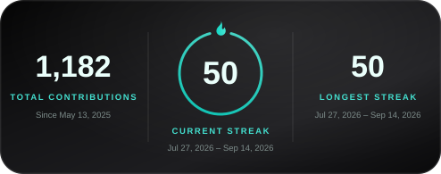
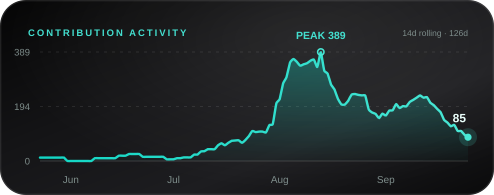
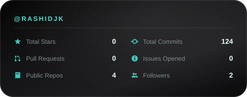

<div align="center">
  
</div>

<div align="center">



<!--

[](https://git.io/streak-stats)
-->

## ⏱️ Coding Activity
<!--START_SECTION:waka-->


**🐱 My GitHub Data** 

> 📦 41.0 kB Used in GitHub's Storage 
 > 
> 🏆 765 Contributions in the Year 2026
 > 
> 🚫 Not Opted to Hire
 > 
> 📜 4 Public Repositories 
 > 
> 🔑 21 Private Repositories 
 > 
**I'm an Early 🐤** 

```text
🌞 Morning                2187 commits        ██████░░░░░░░░░░░░░░░░░░░   25.13 % 
🌆 Daytime                4394 commits        █████████████░░░░░░░░░░░░   50.48 % 
🌃 Evening                1892 commits        █████░░░░░░░░░░░░░░░░░░░░   21.74 % 
🌙 Night                  231 commits         █░░░░░░░░░░░░░░░░░░░░░░░░   02.65 % 
```
📅 **I'm Most Productive on Thursday** 

```text
Monday                   882 commits         ███░░░░░░░░░░░░░░░░░░░░░░   10.13 % 
Tuesday                  1555 commits        ████░░░░░░░░░░░░░░░░░░░░░   17.87 % 
Wednesday                1110 commits        ███░░░░░░░░░░░░░░░░░░░░░░   12.75 % 
Thursday                 3228 commits        █████████░░░░░░░░░░░░░░░░   37.09 % 
Friday                   1060 commits        ███░░░░░░░░░░░░░░░░░░░░░░   12.18 % 
Saturday                 755 commits         ██░░░░░░░░░░░░░░░░░░░░░░░   08.67 % 
Sunday                   114 commits         ░░░░░░░░░░░░░░░░░░░░░░░░░   01.31 % 
```


📊 **This Week I Spent My Time On** 

```text
🕑︎ Time Zone: Africa/Dar_es_Salaam

💬 Programming Languages: 
TypeScript               6 hrs 48 mins       ███████░░░░░░░░░░░░░░░░░░   29.61 % 
JavaScript               5 hrs 39 mins       ██████░░░░░░░░░░░░░░░░░░░   24.60 % 
Other                    4 hrs 50 mins       █████░░░░░░░░░░░░░░░░░░░░   21.05 % 
Dart                     3 hrs 1 min         ███░░░░░░░░░░░░░░░░░░░░░░   13.13 % 
Markdown                 1 hr 13 mins        █░░░░░░░░░░░░░░░░░░░░░░░░   05.35 % 

🔥 Editors: 
Claude Code              16 hrs 52 mins      ██████████████████░░░░░░░   73.34 % 
VS Code                  6 hrs 7 mins        ███████░░░░░░░░░░░░░░░░░░   26.66 % 

🐱‍💻 Projects: 
Unknown Project          5 hrs 39 mins       ██████░░░░░░░░░░░░░░░░░░░   24.60 % 
Budget                   4 hrs 9 mins        █████░░░░░░░░░░░░░░░░░░░░   18.11 % 
rashid-s-product-studio  2 hrs 2 mins        ██░░░░░░░░░░░░░░░░░░░░░░░   08.91 % 
backend                  1 hr 54 mins        ██░░░░░░░░░░░░░░░░░░░░░░░   08.29 % 
prompt-stock-keeper      1 hr 34 mins        ██░░░░░░░░░░░░░░░░░░░░░░░   06.87 % 
```

🤖 **AI Coding This Week** 

```text
⏱ AI Coding Time: 17 hrs 5 mins (74.35%)

✍️ 13,140 lines written by AI, 1,014 lines written by hand (92.84% AI-written)

🔤 15,233,992 Input Tokens, 1,993,831 Output Tokens

💵 $558.75 Estimated AI Cost This Week

🧠 22 AI Sessions, 182 AI Prompts

Opus                     13,880 lines        █████████████████████████   100.00 % 
Claude-Code              0 lines             ░░░░░░░░░░░░░░░░░░░░░░░░░   00.00 % 

🔎 AI Coding Insights:
🤖 AI-Driven — 92.84% of written lines came from AI
📄 Detailed Prompter — average 956 characters per prompt
🔁 Iterative Prompter — average 8 prompts per session
🚀 High AI Trust — 7.61% of changed lines were hand-edited
```

**I Mostly Code in TypeScript** 

```text
TypeScript               31 repos            ██████████████████████░░░   86.11 % 
Python                   2 repos             █░░░░░░░░░░░░░░░░░░░░░░░░   05.56 % 
Dart                     1 repo              █░░░░░░░░░░░░░░░░░░░░░░░░   02.78 % 
SCSS                     1 repo              █░░░░░░░░░░░░░░░░░░░░░░░░   02.78 % 
CSS                      1 repo              █░░░░░░░░░░░░░░░░░░░░░░░░   02.78 % 
```


**Timeline**


 Last Updated on 22/08/2026 21:05:30 UTC
<!--END_SECTION:waka-->

</div>
