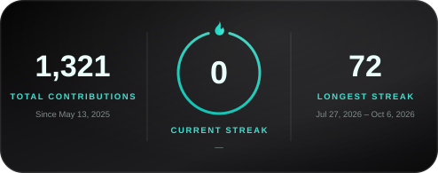
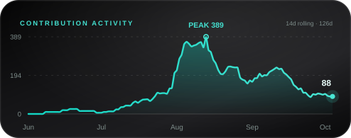
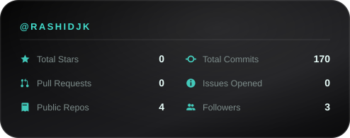
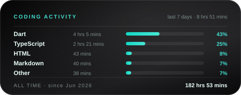
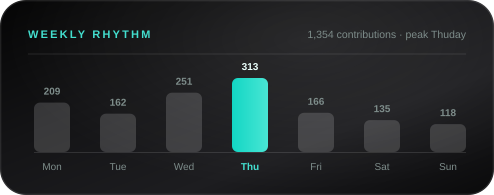

  

<!--

-->

  
  

<svg width="744" height="292" viewBox="0 0 744 292"
     xmlns="http://www.w3.org/2000/svg">

  <defs>
    <linearGradient id="bg" x1="0" y1="0" x2="1" y2="1">
      <stop offset="0%" stop-color="#202022"/>
      <stop offset="100%" stop-color="#151517"/>
    </linearGradient>
    <linearGradient id="bar" x1="0" y1="0" x2="1" y2="0">
      <stop offset="0%" stop-color="#2edfd0"/>
      <stop offset="100%" stop-color="#48d8cc"/>
    </linearGradient>
    <filter id="glow">
      <feGaussianBlur stdDeviation="5" result="blur"/>
      <feMerge>
        <feMergeNode in="blur"/>
        <feMergeNode in="SourceGraphic"/>
      </feMerge>
    </filter>
  </defs>

  <!-- CARD -->
  <rect x="1" y="1" width="742" height="290" rx="28"
        fill="url(#bg)"
        stroke="#363639"
        stroke-width="1.5"/>

  <!-- HEADER -->
  <text x="40" y="43"
        fill="#43e4d4"
        font-family="Arial, Helvetica, sans-serif"
        font-size="13"
        font-weight="700"
        letter-spacing="3">
    TECH STACK EXPERIENCE
  </text>

  <text x="700" y="43"
        fill="#77777b"
        font-family="Arial, Helvetica, sans-serif"
        font-size="11"
        text-anchor="end">
    7 technologies
  </text>

  <!-- COLUMN LABELS -->
  <text x="40" y="76"
        fill="#6f7075"
        font-family="Arial, Helvetica, sans-serif"
        font-size="10"
        font-weight="700"
        letter-spacing="1.5">
    TECHNOLOGY
  </text>

  <text x="255" y="76"
        fill="#6f7075"
        font-family="Arial, Helvetica, sans-serif"
        font-size="10"
        font-weight="700"
        letter-spacing="1.5">
    EXPERIENCE
  </text>

  <text x="650" y="76"
        fill="#6f7075"
        font-family="Arial, Helvetica, sans-serif"
        font-size="10"
        font-weight="700"
        letter-spacing="1.5"
        text-anchor="end">
    USAGE
  </text>

  <!-- ROW 1: TYPESCRIPT -->
  <text x="40" y="105"
        fill="#f1f1f2"
        font-family="Arial, Helvetica, sans-serif"
        font-size="14"
        font-weight="600">
    TypeScript
  </text>

  <rect x="255" y="96" width="300" height="8" rx="4"
        fill="#303034"/>
  <rect x="255" y="96" width="285" height="8" rx="4"
        fill="url(#bar)"
        filter="url(#glow)"/>

  <text x="650" y="105"
        fill="#43e4d4"
        font-family="Arial, Helvetica, sans-serif"
        font-size="13"
        font-weight="700"
        text-anchor="end">
    95%
  </text>

  <!-- ROW 2: REACT -->
  <text x="40" y="139"
        fill="#f1f1f2"
        font-family="Arial, Helvetica, sans-serif"
        font-size="14"
        font-weight="600">
    React
  </text>

  <rect x="255" y="130" width="300" height="8" rx="4"
        fill="#303034"/>
  <rect x="255" y="130" width="255" height="8" rx="4"
        fill="url(#bar)"/>

  <text x="650" y="139"
        fill="#43e4d4"
        font-family="Arial, Helvetica, sans-serif"
        font-size="13"
        font-weight="700"
        text-anchor="end">
    85%
  </text>

  <!-- ROW 3: DART -->
  <text x="40" y="173"
        fill="#f1f1f2"
        font-family="Arial, Helvetica, sans-serif"
        font-size="14"
        font-weight="600">
    Dart / Flutter
  </text>

  <rect x="255" y="164" width="300" height="8" rx="4"
        fill="#303034"/>
  <rect x="255" y="164" width="240" height="8" rx="4"
        fill="url(#bar)"/>

  <text x="650" y="173"
        fill="#43e4d4"
        font-family="Arial, Helvetica, sans-serif"
        font-size="13"
        font-weight="700"
        text-anchor="end">
    80%
  </text>

  <!-- ROW 4: PYTHON -->
  <text x="40" y="207"
        fill="#f1f1f2"
        font-family="Arial, Helvetica, sans-serif"
        font-size="14"
        font-weight="600">
    Python
  </text>

  <rect x="255" y="198" width="300" height="8" rx="4"
        fill="#303034"/>
  <rect x="255" y="198" width="195" height="8" rx="4"
        fill="url(#bar)"/>

  <text x="650" y="207"
        fill="#43e4d4"
        font-family="Arial, Helvetica, sans-serif"
        font-size="13"
        font-weight="700"
        text-anchor="end">
    65%
  </text>

  <!-- ROW 5: JAVA -->
  <text x="40" y="241"
        fill="#f1f1f2"
        font-family="Arial, Helvetica, sans-serif"
        font-size="14"
        font-weight="600">
    Java
  </text>

  <rect x="255" y="232" width="300" height="8" rx="4"
        fill="#303034"/>
  <rect x="255" y="232" width="135" height="8" rx="4"
        fill="url(#bar)"/>

  <text x="650" y="241"
        fill="#43e4d4"
        font-family="Arial, Helvetica, sans-serif"
        font-size="13"
        font-weight="700"
        text-anchor="end">
    45%
  </text>

  <!-- ROW 6: C++ -->
  <text x="40" y="275"
        fill="#f1f1f2"
        font-family="Arial, Helvetica, sans-serif"
        font-size="14"
        font-weight="600">
    C++
  </text>

  <rect x="255" y="266" width="300" height="8" rx="4"
        fill="#303034"/>
  <rect x="255" y="266" width="105" height="8" rx="4"
        fill="url(#bar)"/>

  <text x="650" y="275"
        fill="#43e4d4"
        font-family="Arial, Helvetica, sans-serif"
        font-size="13"
        font-weight="700"
        text-anchor="end">
    35%
  </text>

</svg>

